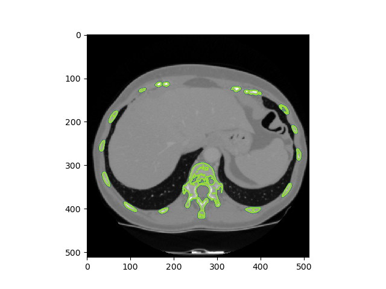

[](https://travis-ci.org/mjirik/io3d)
[](https://coveralls.io/r/mjirik/io3d?branch=master)
[](http://io3d.readthedocs.io/en/latest/?badge=latest)

# io3d

This package contains set of functions used for reading and writing 3D data.

## Install

Use anaconda 

```shell
conda install -c mjirik -c conda-forge -c SimpleITK -c bioconda io3d
```

or

```shell
pip install io3d
```

You can use 3D viewer sed3 for visualization.

```shell
pip install sed3
```

## Examples

[Check the tutorial](examples/tutorial_read_dataset_and_see_with_sed3.ipynb)

### Read and show data from url

```python
import io3d
import matplotlib.pyplot as plt

datap = io3d.read("http://home.zcu.cz/~mjirik/lisa/sample_data/nrn4.pklz")
plt.imshow(datap.data3d[10,:,:], cmap='gray')
plt.show()
```


### Get sample data

Data will be automatically downloaded to `~\data\`

command line:
```shell
python -m io3d -l 3Dircadb1.1
```

### Read data and see one slice

```python
import io3d
from matplotlib import pyplot as plt

# get path the data stored in default data directory
pth = io3d.datasets.joinp("medical/orig/3Dircadb1.1/MASKS_DICOM/")
datap = io3d.read(pth)
print(datap.voxelsize_mm)
# size of voxel can be accessed also by datap["voxelsize_mm"]

# see slice 10
plt.imshow(datap.data3d[5,:,:], cmap='gray')
plt.show()
```

Intensity image `data3d` and `voxelsize_mm` can be accessed easier through the datap properies


### Use object DataReader and see data in simple viewer

```python
import io3d
import sed3

pth = io3d.datasets.joinp("medical/orig/3Dircadb1.1/MASKS_DICOM/")
dr = io3d.DataReader()
datap = dr.Get3DData(pth, dataplus_format=True)

ed = sed3.sed3(datap['data3d'])
ed.show()
```

### Use CLI

```shell
python io3d/datareader.py -i ./sample_data/jatra_5mm/
```

### Use it in your application - Qt Widget

```python
import sys
from PyQt5 import QtGui
import io3d.datareaderqt

app = QtGui.QApplication(sys.argv)    
w = io3d.datereaderqt.DatareaderWidget()
w.show()
app.exec_()
datap = w.datap
```


## Dataset

Read more about [dataset setup](examples/dataset_setup.ipynb) and how to [use datasets](examples/datasets_read.ipynb).

Get sample data with `io3d` package:

```shell
python -m io3d -l 3Dircadb1.1
```

Get list of available datasets:

```shell
python -m io3d -L
```

... or download data:

[io3d_sample_data](http://147.228.240.61/queetech/sample-extra-data/io3d_sample_data.zip)

[ct_head.rawiv](http://mgltools.scripps.edu/downloads/tars/releases/DocTars/DOCPACKS/Vision/doc/Tutorial/headandslice/ct_head.rawiv)

Put this data into sample_data dir.


### File or directory checksum

```shell
python -m io3d -c directory_path
```


### Specific dataset path

Some parts of dataset can be stored separately. 
You can set it by command

```shell
python -m io3d -ssdp "g:/Můj disk/data/biology/roots" "biology/roots"
python -m io3d -ssdp "g:/Můj disk/data/medical/orig/sliver07" "medical/orig/sliver07"
```

or you can edit `~\.io3d_cache.yaml`


### Get by url

Data can be downloaded from url. Just use URL instead of `label`.
The local path can be specified by adding local path to the end of url separated by colon.'

```bash
python -m io3d.datasets -l http://home.zcu.cz/~mjirik/lisa/sample_data/biodur_sample.zip:biodur_sample/
```
```bash
python -m io3d.datasets -l https://downloads.openmicroscopy.org/images/OME-TIFF/2016-06/bioformats-artificial/time-series.ome.tif:biology/orig/roots
```


### Read datasets coherently


```python
import io3d
import matplotlib.pyplot as plt
datap1 = io3d.read_dataset("3Dircadb1", "data3d", 1)
datap2 = io3d.read_dataset("3Dircadb1", "bone", 1)
plt.imshow(datap1["data3d"][20,:,:], cmap="gray")
plt.contour(datap2["data3d"][20,:,:])
plt.show()
```



Now you can read the sliver07 dataset in the same way. Just put it in `data/orig/medical/sliver07`

```python
import io3d
import matplotlib.pyplot as plt
datap1 = io3d.read_dataset("sliver07", "data3d", 1)
plt.imshow(datap1["data3d"][20,:,:], cmap="gray")
plt.show()
```

The path where the datafiles are looked for can be checked by `get_dataset_path` function.

```python
import io3d.datasets
pth = io3d.datasets.get_dataset_path("sliver07", "data3d", 1)
```

