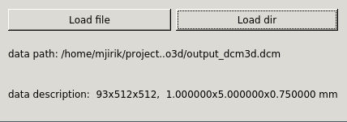

[](https://travis-ci.org/mjirik/io3d)
[](https://coveralls.io/r/mjirik/io3d?branch=master)
[](http://io3d.readthedocs.io/en/latest/?badge=latest)

# io3d

This package contains set of functions used for reading and writing 3D data.

## Install

Use anaconda 

```shell
conda install -c mjirik io3d
```

or

```shell
pip install io3d
```

You can use 3D viewer sed3 for visualization.

```shell
pip install sed3
```

## Examples

### Example 1

```shell
python io3d/datareader.py -i ./sample_data/jatra_5mm/
```

### Example 2

```python
import io3d
import sed3
dr = io3d.DataReader()
datap = dr.Get3DData('sample_data/jatra_5mm/', dataplus_format=True)

ed = sed3.sed3(datap['data3d'])
ed.show()
```

### Example 3 - Qt Widget

```python
import io3d.datareaderqt
app = QtGui.QApplication(sys.argv)    
w = io3d.datereaderqt.DatareaderWidget()
w.show()
app.exec_()
datap = w.datap
```




## Test data

Get sample data with `io3d` package:

```shell
python -m io3d -l 3Dircadb1.1
```

Get list of available datasets:

```shell
python -m io3d -L
```

... or download data:

[io3d_sample_data](http://147.228.240.61/queetech/sample-extra-data/io3d_sample_data.zip)

[ct_head.rawiv](http://mgltools.scripps.edu/downloads/tars/releases/DocTars/DOCPACKS/Vision/doc/Tutorial/headandslice/ct_head.rawiv)

Put this data into sample_data dir.


### File or directory checksum

```shell
python -m io3d -c directory_path
```
